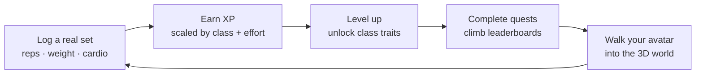
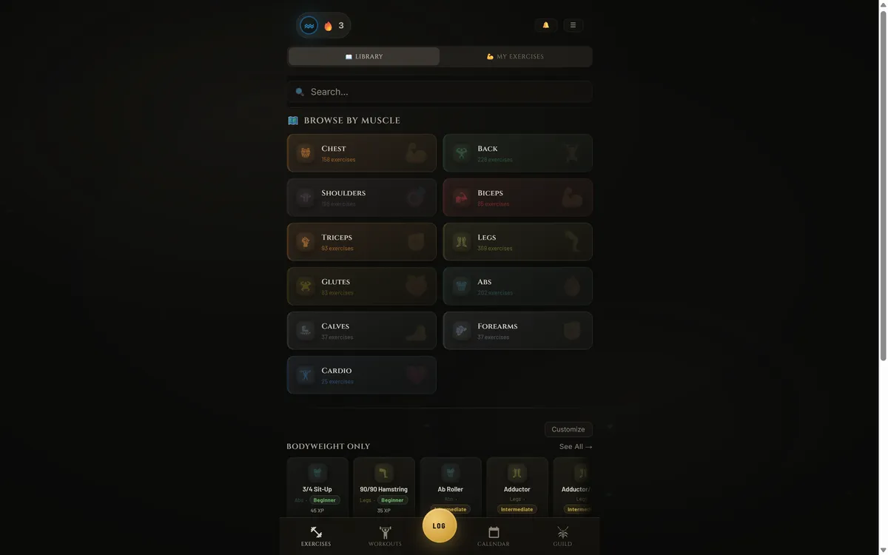
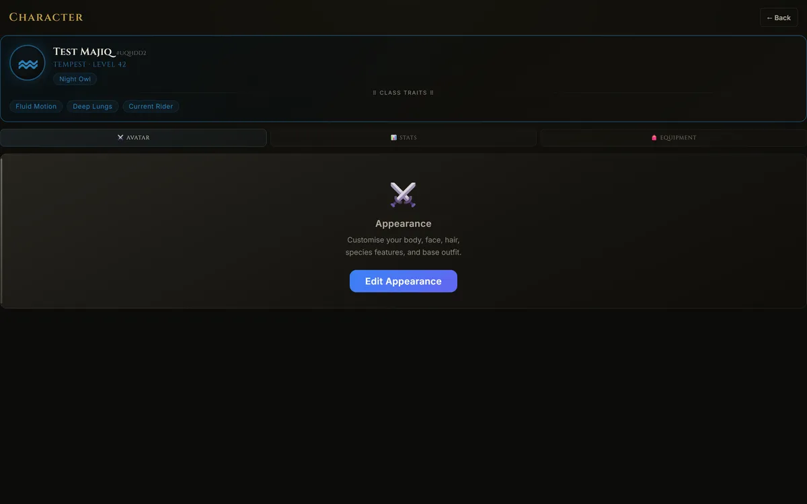
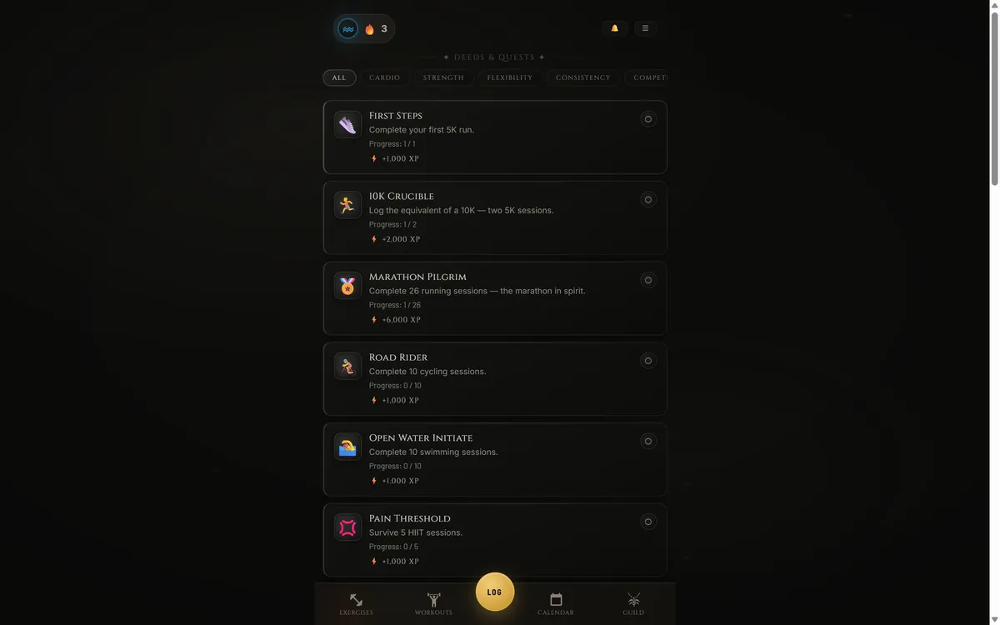
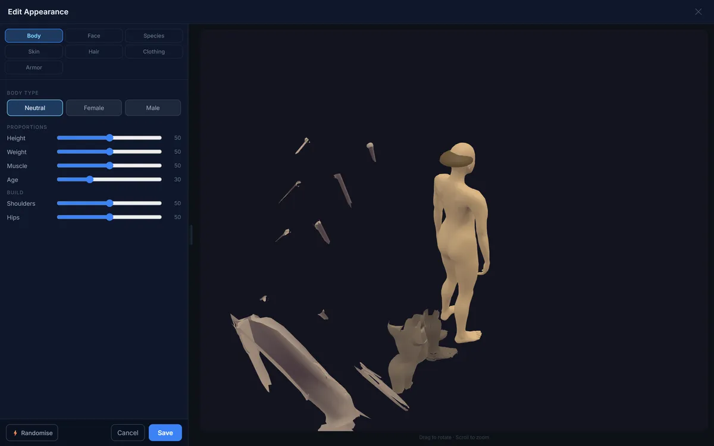
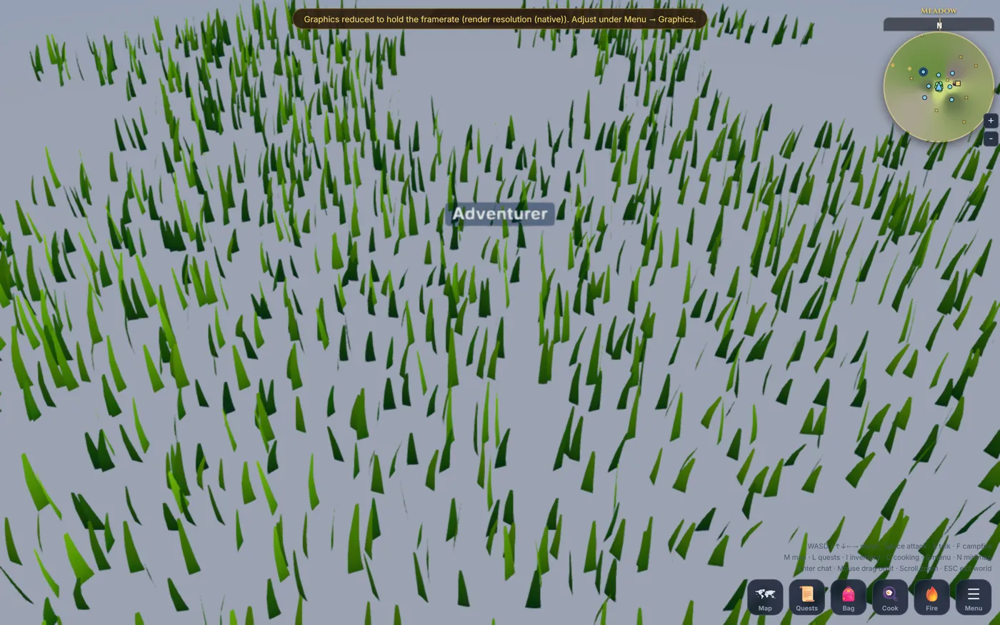
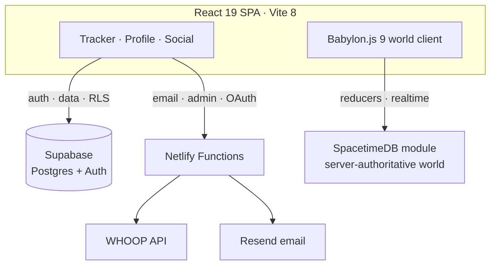

<div align="center">


# AURISAR

### A real fitness tracker wearing a character sheet.

[](https://aurisargames.com)
&nbsp;
[](https://github.com/Brandonla3/aurisar-app/actions/workflows/ci.yml)


</div>

---

## The character sheet

Aurisar turns your workout data into a character you level up. So here is the repository, playing by its own rules — every stat below is a real, checkable number from this codebase:

| Stat | Value | What it really is |
|---|---:|---|
| 🎖️ **Class** | Solo Dev / Full-Stack | one person, every layer |
| ⚔️ **XP** | 300+ commits | since the first commit on 2026-03-28 |
| ❤️ **HP** | 140,000+ | lines of application code |
| 📚 **Spellbook** | 1,544 exercises · 11 classes | the content that drives progression |
| 🧪 **Trials passed** | 1,542 | passing tests across 140 test files |
| 🗺️ **Zones** | 15 | feature modules under `src/features` |
| 👥 **Party size** | 1 | solo-built |
| 🟢 **Status** | LIVE | in production at [aurisargames.com](https://aurisargames.com) |

---

## What is this?

Aurisar is a genuine workout logger — reps, sets, weight, cardio, rest, a **1,544-exercise** database, personal-best tracking, and optional **WHOOP** wearable sync. What makes it different is what it does with that data: it pays it back as a game.

> **Every rep is XP. Every session is a quest. Every week is a chapter.**

You pick one of **11 character classes**, level up as you train, complete quests, climb leaderboards, build a 3D avatar, and step into a browser-based multiplayer world. It's a fitness tracker for people who never wanted a spreadsheet — they wanted a save file.

---

## The loop

The whole product is one compulsion loop, and it runs on real numbers, not points-for-nothing:



A logged exercise is worth roughly **35–50 XP**; quests pay **+1,000 to +6,000 XP**; the character on the sheet above is a level-42 **Tempest**. The maths lives in [`src/utils/xp.js`](src/utils/xp.js) — class multipliers, cardio-interval and pace bonuses, a 100-level curve — and it is the same engine the live app runs.

---

## The quickstart you were expecting

```console
$ git clone https://github.com/Brandonla3/aurisar-app && cd aurisar-app
$ npm install
$ npm run dev

  ✖  Error: AURISAR_ALREADY_RUNNING
     The world server, database, and multiplayer backend are live in production.
     You can read the code — you can't boot your own realm from it.
```

### The real one — 60 seconds, no terminal

1. Open **[aurisargames.com](https://aurisargames.com)** →
2. **Forge a Profile** (email + password) →
3. Pick your class from the reveal →
4. Log one set. Watch it become XP.

**Smoke test:** if your reps turned into XP and your character gained a level, the build is green. You are now the runtime.

---

## Inside the app

<table>
  <tr>
    <td width="50%"><br/><b>1,544-exercise library</b><br/>Browse by muscle, difficulty, and equipment. Every exercise is priced in XP.</td>
    <td width="50%"><br/><b>Classes &amp; progression</b><br/>11 classes, each with traits and XP multipliers that reward how you actually train.</td>
  </tr>
  <tr>
    <td width="50%"><br/><b>Quests &amp; leaderboards</b><br/>Daily and lifetime deeds, global and friends leaderboards, streaks.</td>
    <td width="50%"><br/><b>3D avatar creator</b><br/>Sculpt body, face, species and gear on a live Babylon.js character.</td>
  </tr>
  <tr>
    <td colspan="2"><br/><b>A browser-native 3D world</b> <sub>(in active development)</sub> — a Babylon.js client with procedural terrain and avatars, backed by a server-authoritative <b>SpacetimeDB</b> world module (quests, chests, campfires, cooking). The whole realm renders in the same tab you logged your workout in.</td>
  </tr>
</table>

---

## Under the hood



| Layer | Choice | Rarity |
|---|---|---|
| Frontend | React 19, Vite 8, no router (a screen/tab state machine) | Common |
| 3D | Babylon.js 9 (procedural terrain, avatars, NME shaders) | Rare |
| Data & auth | Supabase — Postgres, Row-Level Security, MFA, passkeys | Common |
| Backend | Netlify Functions (WHOOP OAuth, Resend outbox, admin, Turnstile) | Uncommon |
| Multiplayer | SpacetimeDB — a server-authoritative TypeScript world module | Legendary |
| Wearables | WHOOP recovery/strain/workout sync | Rare |

---

## Running the code

The **servers** (Supabase project, SpacetimeDB world module, WHOOP/Resend credentials) are production-only — this repo is public to be **read**, not booted end-to-end. The frontend, however, runs:

```bash
npm install          # Node 20; installs the full toolchain (Babylon, sharp, vitest)
npm run dev          # Vite dev server on http://localhost:5173
npm test             # 1,542 tests across 140 files (vitest)
npm run build        # production build → build/
```

A Preview/PIN mode boots a seeded demo character without a backend (dev only). Real data needs the env vars in [`.env.example`](.env.example) pointed at your own Supabase project.

> **Windows note:** on a fresh Windows checkout (`core.autocrlf=true`), the byte-for-byte freshness gates `check:assets`, `vendor:meshopt:check`, `emit:castle:check`, and `emit:world-chests:check` can false-fail on CRLF line endings. This is a known line-ending quirk, not a regression — Linux CI is the source of truth and is green.

### Project structure

```
src/
├── App.jsx                 # the app shell: screens, tabs, auth, XP, save loop
├── features/               # 15 feature zones
│   ├── exercises/          # the 1,544-exercise library + editor
│   ├── workouts/           # workout builder, live tracker, plans
│   ├── profile/ character/ # progression, stats, avatar
│   ├── world/              # the Babylon.js 3D world + SpacetimeDB client
│   ├── whoop/ social/ …    # wearables, guild, messaging, quests, leaderboard
│   └── avatar/             # the 3D avatar creator + GLB pipeline
├── data/exercises.js       # the master exercise + class database
└── utils/xp.js             # the XP / progression engine
netlify/functions/          # serverless backend (auth, email, WHOOP, admin)
spacetimedb/                # the server-authoritative world module
scripts/security/           # Postgres schema, RLS policies, migrations
```

For contributor conventions, dev-loop caveats, and the PR workflow, see [`AGENTS.md`](AGENTS.md).

---

## Status

Aurisar is **live and in active development**, built and maintained by one person. It ships behind CI (build, 1,542 tests, and a suite of determinism gates), a hardened Supabase RLS schema, MFA/passkey auth, and a strict Content-Security-Policy. Like any solo-built production app it has a working backlog of correctness and hardening work, tracked in the repository's issues.

## Contributing

Not accepting code contributions right now — but **playtesting and bug reports are gold.** Play at [aurisargames.com](https://aurisargames.com) and use the in-app feedback button, or open an issue. A good bug report is a completed quest.

## License

**© 2026 Aurisar Games. All rights reserved.** This source is published for reading and reference. It is **not** open source — no license to use, copy, modify, or redistribute the code, assets, or game content is granted. The exercise database and 3D assets carry their own attributions (see [`public/assets/ATTRIBUTION.md`](public/assets/ATTRIBUTION.md)).

<div align="center">
<sub>Built solo, in the open, one rep at a time.</sub>
</div>
